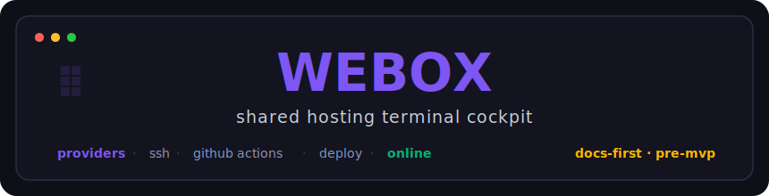
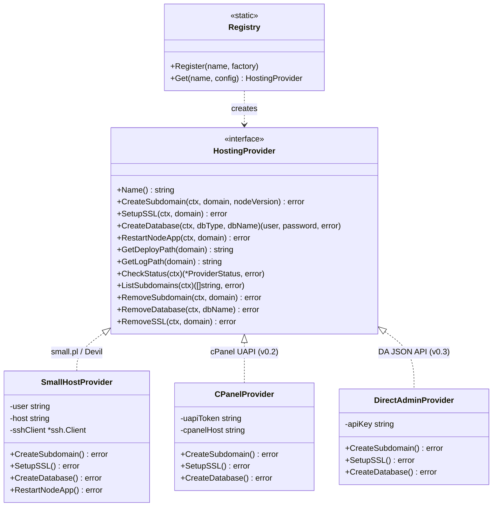
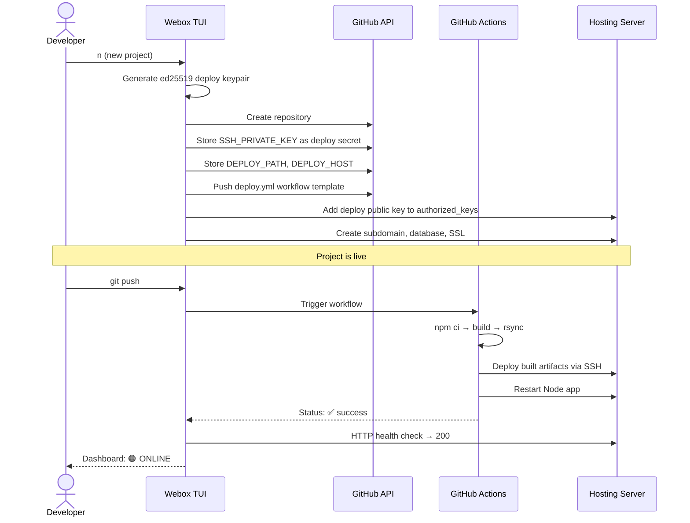
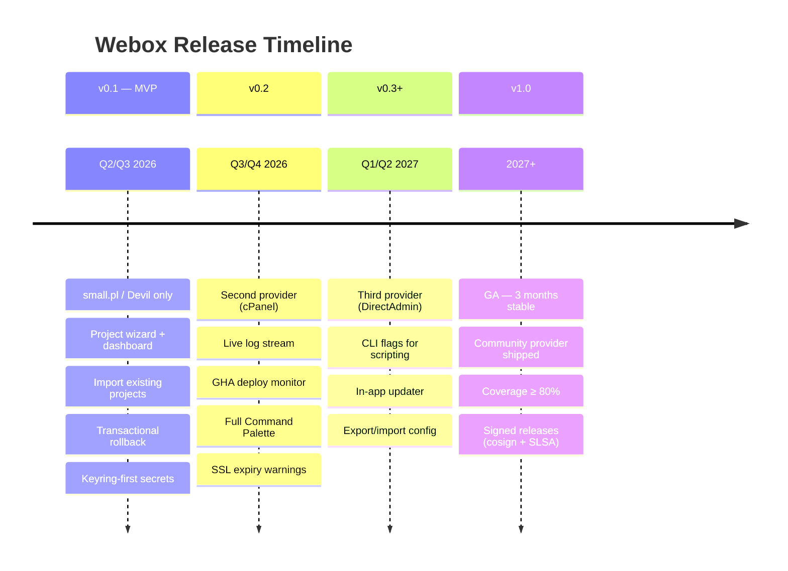

<p align="center">
  
</p>

<p align="center">
  <strong>Your shared hosting, operated from one terminal.</strong>
</p>

<p align="center">
  <a href="https://github.com/dilitS/webox/actions/workflows/ci.yml"></a>
  <a href="https://github.com/dilitS/webox/blob/main/LICENSE"></a>
  <a href="docs/ROADMAP.md"></a>
  <a href="https://pkg.go.dev/github.com/dilitS/webox"></a>
  <a href="docs/ROADMAP.md"></a>
</p>

---

Webox is a **terminal operator cockpit** for developers running projects on shared hosting.
One screen instead of bouncing between a hosting panel, SSH, GitHub, SSL settings, log files, and private shell scripts.

> **Current phase:** docs-first / pre-MVP. The implementation starts after the audit gates are accepted. No production binary is published yet.

```text
 ╭─ Webox Cockpit ───────────────────────────────────────────────────────────────────╮
 │ [Profile: main · s1.small.pl · 14ms]                                    [/] 20:17 │
 │                                                                                   │
 │  ╭─ Projects ──────────────────────╮ ╭─ sui.biuromody.smallhost.pl ────────────╮  │
 │  │  ▶ sui.biuromody           🟢   │ │  Status  │ 🟢 ONLINE                    │  │
 │  │    makspomoc               🟢   │ │  Node    │ v24.15.0                     │  │
 │  │    si                🟡 BUILD   │ │  SSL     │ 🔐 27 days left              │  │
 │  │    legacy              STALE   │ │  Deploy  │ ✓ 2h ago (3fdc34d)           │  │
 │  │                                │ │                                          │  │
 │  │  [n] New  [i] Import           │ │  [r] Restart  [s] SSL  [v] Logs         │  │
 │  ╰────────────────────────────────╯ ╰──────────────────────────────────────────╯  │
 │                                                                                   │
 │  q:quit  ↑↓:navigate  →:details  n:new  /:command  ?:help                         │
 ╰───────────────────────────────────────────────────────────────────────────────────╯
```

## Install

Webox is not released yet. The repository is currently in the **pre-MVP, docs-first** phase: architecture, security posture, testing strategy, and development guardrails are being locked before production code starts.

Planned install paths for `v0.1`:

```bash
brew install webox/tap/webox   # planned
go install github.com/dilitS/webox/cmd/webox@latest   # planned
```

Track release readiness in [`docs/ROADMAP.md`](docs/ROADMAP.md) and the pre-implementation audit in [`docs/AUDIT.md`](docs/AUDIT.md).

### Try it offline (no server required)

The repository ships a **mock-data mode** that boots the full cockpit with deterministic demo content — six demo projects, a SUCCESS pipeline, live-log fixtures — without making a single SSH/HTTP/GitHub call. Use it for screenshots, UX iteration, or just to feel the UI before you connect a real profile.

```bash
make build                        # produces ./bin/webox
./bin/webox --mock                # boots the Bento Ultra dashboard offline
WEBOX_MOCK=1 ./bin/webox          # equivalent env-var toggle
```

The mock fixtures live in [`tui/mockdata.go`](tui/mockdata.go) and contain only synthetic data (`shop-ease.io`, fake commit SHAs, fake build numbers). Nothing here resembles a real secret, so the redactor regression corpus stays intact.

---

## 📐 Architecture

Webox is a Go monolith built on **MVU (Model-View-Update)** via [Bubble Tea](https://github.com/charmbracelet/bubbletea) + [Lipgloss](https://github.com/charmbracelet/lipgloss). One binary, zero external runtimes.

```mermaid
flowchart TB
    subgraph TUI["tui/ — Bubble Tea Layer"]
        Model["TUI Model<br/>State + ActiveTab + Width"]
        View["View()<br/>Pure Render"]
        Update["Update()<br/>State Mutation"]
        Cmd["tea.Cmd<br/>Async Side Effects"]
    end

    subgraph Core["Core Services"]
        Providers["providers/<br/>HostingProvider Interface"]
        SSH["ssh/<br/>Connection Pool<br/>SFTP + Exec"]
        GitHub["services/<br/>GitHub REST API<br/>Actions + Secrets"]
        Secrets["secrets/<br/>Keyring + AES-GCM Fallback"]
    end

    subgraph Storage["Local State"]
        Config["~/.config/webox/config.json<br/>Atomic write + flock"]
        Keyring["System Keyring<br/>Keychain / SecretService / CredMan"]
        Known["known_hosts<br/>Dedicated SSH trust"]
    end

    User["User Keypress"] --> Update
    Update --> Model
    Model --> View
    View --> Terminal["Stdout TTY"]

    Cmd --> Providers
    Cmd --> SSH
    Cmd --> GitHub
    Cmd --> Secrets

    Providers --> SSH
    SSH --> Host["Shared Hosting Server<br/>small.pl (v0.1)<br/>cPanel / DirectAdmin later"]
    GitHub --> GHA["GitHub Actions<br/>CI/CD Pipeline"]

    Secrets --> Keyring
    Config --> Disk["Atomic fsync + rename"]

    style TUI fill:#1a1b26,stroke:#7d56f4
    style Core fill:#13141f,stroke:#04b575
    style Storage fill:#13141f,stroke:#ffb800
```



### Provider Pattern

Every hosting panel is hidden behind one contract. Adding a new panel means implementing the interface — nothing in the TUI or business logic changes.



---

## 🚀 Project Creation — 5 Steps, Transactional

Creating a new project means subdomain, SSL, database, GitHub repo, CI/CD wiring, and first deploy — all from one wizard. If anything fails mid-way, Webox rolls back cleanly. No orphaned resources.

```mermaid
flowchart LR
    Step1["① Pre-flight<br/>Check git, gh, keyring"] --> Step2["② Subdomain<br/>Create + DNS probe"]
    Step2 --> Step3["③ Database<br/>MySQL / PgSQL<br/><i>skipped for static</i>"]
    Step3 --> Step4["④ SSL<br/>Let's Encrypt"]
    Step4 --> Step5["⑤ Deploy<br/>GitHub repo + secrets<br/>Actions workflow + push"]

    Step5 --> Success["✅ Dashboard"]

    Step2 -.->|DNS not ready| Wait["DNS pending…<br/>retry in background"]
    Step4 -.->|Rate limited| Retry["Retry after backoff"]
    Step3 -.->|Name taken| Fix["User corrects name<br/>→ Resume"]

    style Step1 fill:#24273a,stroke:#4e5a85
    style Step2 fill:#24273a,stroke:#7d56f4
    style Step3 fill:#24273a,stroke:#7d56f4
    style Step4 fill:#24273a,stroke:#7d56f4
    style Step5 fill:#24273a,stroke:#7d56f4
    style Success fill:#1a3a2a,stroke:#04b575
    style Retry fill:#3a2a1a,stroke:#ffb800
    style Fix fill:#3a2a1a,stroke:#ffb800
```



### Deployment Pipeline

Code always deploys through GitHub Actions. Webox generates the workflow, sets up per-project deploy keys, and monitors runs from the dashboard.



---

## ⚡ Features & Priorities

| ID | Feature | v0.1 | v0.2 | v0.3 |
|----|---------|:----:|:----:|:----:|
| **F1** | Init wizard — first-run setup, keypair, GitHub auth | ✅ | · | · |
| **F3** | Project creation wizard (subdomain → DB → SSL → deploy) | ✅ | · | · |
| **F4** | Dashboard — project list + detail panel with live status | ✅ | · | · |
| **F5** | Status check — HTTP ping, SSL cert info, Node version | ✅ | · | · |
| **F6** | Restart application (one key from dashboard) | ✅ | · | · |
| **F7** | SSL management — Let's Encrypt issue + renew | ✅ | · | · |
| **F8** | Log viewer — tail last N lines | ✅ | · | · |
| **F9** | Import existing projects (read-only, detects settings gaps) | ✅ | · | · |
| **F10** | Transactional rollback — clean up on wizard failure | ✅ | · | · |
| **F11** | Secure secret storage — system keyring + AES-GCM fallback | ✅ | · | · |
| **F12** | Command Palette `/` — `/create`, `/import`, `/provider`, `/settings` | ✅ | · | · |
| **F21** | Stack scaffolding — Vite+React, Express, Static | ✅ | · | · |
| **F23** | Stale project detection — drift between config and reality | ✅ | · | · |
| **F13** | Live dashboard auto-refresh | · | ✅ | · |
| **F14** | Live log stream (`tail -f` via SSH) | · | ✅ | · |
| **F15** | GitHub Actions deploy monitor — live workflow runs + logs | · | ✅ | · |
| **F17** | SSL expiry warnings + OS notifications | · | ✅ | · |
| **F18** | Multi-provider dashboard — aggregate projects across panels | · | ✅ | · |
| **F12** | Full command palette — `/db`, `/env`, `/storage`, `/domain` | · | ✅ | · |
| **F21** | Stack scaffolding — Next.js, Nuxt, more | · | ✅ | · |
| **F22** | Non-interactive CLI flags for scripting | · | · | ✅ |
| **F24** | In-app updater with cosign verification | · | · | ✅ |

---

## 🛡️ Security Model

Webox touches real infrastructure and credentials. Security is not an appendix.

```mermaid
flowchart TB
    subgraph Local["Local Machine"]
        Keyring["System Keyring<br/>macOS Keychain<br/>Linux Secret Service<br/>Windows Credential Manager"]
        Fallback["AES-256-GCM<br/>Argon2id KDF<br/>secrets.enc"]
        Config["config.json<br/>No secrets — never"]
        Known["webox known_hosts<br/>Dedicated SSH trust"]
    end

    subgraph Network["Network"]
        SSH["SSH — ed25519 host keys<br/>TOFU on first connect<br/>Strict block on mismatch"]
        GHA["GitHub API — fine-grained PAT<br/>Surgical deploy keys per project<br/>Secrets write-only target"]
    end

    subgraph Server["Server"]
        DeployKey["Per-project deploy key<br/>authorized_keys with comment"]
        EnvFile[".env — 0600 permissions<br/>Outside web root<br/>Env drift detection later"]
    end

    Keyring --> SSH
    Fallback --> SSH
    Known --> SSH
    SSH --> DeployKey
    DeployKey --> EnvFile
    GHA --> EnvFile

    style Local fill:#1a1b26,stroke:#7d56f4
    style Network fill:#13141f,stroke:#ffb800
    style Server fill:#13141f,stroke:#04b575
```



| Principle | Implementation |
|---|---|
| **Zero plaintext secrets in config** | `config.json` contains metadata only. Tokens and passwords live in system keyring. |
| **Headless fallback** | When keyring is unavailable (Linux server, WSL, Docker), AES-256-GCM encrypted file with Argon2id-derived key. |
| **SSH host-key verification** | Dedicated `known_hosts`, TOFU on first connect, **strict block** on mismatch — never auto-accept. |
| **Per-project deploy keys** | Webox generates fresh `ed25519` keypairs per project for GitHub Actions. Never reuses your personal SSH key. |
| **GitHub token scope** | Fine-grained PAT with `Contents`, `Workflows`, `Actions`, `Secrets` — scoped per repository. |
| **Zero remote telemetry** | All logging and metrics stay local. `webox doctor` for diagnostics. No data ever leaves your machine. |
| **Defensive parsing** | All hosting panel CLI output is regex-parsed with strict validation. No `eval`, no blind `exec`. |

Read the full threat model in [`docs/SECURITY.md`](docs/SECURITY.md).

---

## 🗺️ Roadmap



| Milestone | Target | Key Deliverable |
|---|---|---|
| **v0.1** | Q2/Q3 2026 | small.pl MVP: wizard, dashboard, import, rollback, secrets |
| **v0.2** | Q3/Q4 2026 | Second provider (cPanel), live logs, GHA monitoring, full palette |
| **v0.3** | Q1/Q2 2027 | Third provider, CLI scripting, in-app updater |
| **v1.0 GA** | 2027 | 3+ months stable, community provider, ≥80% coverage, signed releases |

---

## 📦 Tech Stack

| Layer | Technology | Why |
|---|---|---|
| **Language** | Go 1.25+ | Single binary, zero runtime deps, excellent SSH/SFTP ecosystem |
| **TUI Framework** | [Bubble Tea](https://github.com/charmbracelet/bubbletea) | MVU architecture, testable via `teatest`, active ecosystem |
| **Styling** | [Lipgloss](https://github.com/charmbracelet/lipgloss) | Declarative terminal styling, OKLCH color space |
| **SSH** | `golang.org/x/crypto/ssh` | Native Go SSH client — no external binary dependency |
| **Keyring** | `github.com/zalando/go-keyring` | Cross-platform system credential store |
| **Linting** | `golangci-lint` v2 | Comprehensive Go linting |
| **CI/CD** | GitHub Actions | Matrix build (macOS + Linux, amd64 + arm64), vulncheck, coverage gates |
| **Release** | GoReleaser + Cosign + SLSA | Signed, verifiable, reproducible builds |

---

## 🏗️ Project Structure

```
webox/
├── cmd/webox/          # Main entry point
├── tui/                # Bubble Tea state machine, views, key bindings
│   ├── views/          # Per-screen render functions
│   └── states.go       # State enum + transitions
├── providers/          # HostingProvider interface + adapters
│   ├── provider.go     # Interface contract
│   ├── registry.go     # Factory registry
│   ├── smallhost.go    # small.pl / Devil adapter (MVP)
│   └── mock.go         # Mock provider for tests
├── ssh/                # Connection pool, SFTP, exec, host key verification
├── services/           # GitHub REST API client, workflow monitoring
├── config/             # config.json model, atomic write, migration
├── secrets/            # Keyring integration, AES-GCM fallback, redactor
├── status/             # Stale-while-revalidate cache, health checks
├── wizard/             # LIFO rollback stack (DAG target architecture: v0.3+)
├── env/                # (v0.2+) .env parsing, diff, merge engine
├── sound/              # (stretch) optional terminal audio feedback
├── translations/       # en.json + pl.json (extensible)
├── testing/            # Mock SSH server, fixtures, golden files, cassettes
├── docs/               # PRD, DESIGN, UX, SECURITY, TESTING, ROADMAP, ADRs
└── assets/             # Embedded workflow templates
```

---

## 🔍 Compared to Alternatives

| Tool | What it does | Why it doesn't replace Webox |
|---|---|---|
| **Coolify / CapRover / Dokploy** | Self-hosted PaaS: deploy, DB, monitoring on VPS | Require VPS with Docker. Can't run on shared hosting where Docker is unavailable. |
| **cPanel / DirectAdmin / Devil** | Web UI for hosting management | No Git integration, no CI/CD, no dashboard — everything is manual clicking. |
| **`devil` CLI / `uapi`** | Single commands from SSH | No multi-project overview, no transactional rollback, no dashboard. |
| **Vercel / Netlify** | One-click deploy from Git | Pay-per-usage model. Different market — you already paid for your shared hosting. |
| **Handwritten shell scripts** | What most devs do today | Local, undocumented, no rollback, fragile across machines. |
| **Laravel Forge / Ploi / RunCloud** | Server management + deploy | Focus on VPS provisioning. Webox targets shared hosting specifically — the "already paid for" niche. |

---

## 📚 Documentation

Webox is **docs-first**. Every architectural decision is recorded before a single line of implementation code.

| Document | Questions it answers |
|---|---|
| [**PRD**](docs/PRD.md) | What is this? Who is it for? What does it NOT do? |
| [**DESIGN**](docs/DESIGN.md) | Architecture, contracts, state machine, caching, rollback |
| [**UX**](docs/UX.md) | Layouts, key bindings, design system, visual components |
| [**SECURITY**](docs/SECURITY.md) | Threat model, secret storage, SSH trust, supply chain |
| [**TESTING**](docs/TESTING.md) | Test pyramid, mock SSH, fixtures, CI pipeline, release checklist |
| [**ROADMAP**](docs/ROADMAP.md) | Version timeline, feature gates, GA criteria |
| [**CONTRIBUTING**](docs/CONTRIBUTING.md) | Setup, conventions, adding a provider, translations, review |
| [**ADRs**](docs/adr/) | Why TUI over CLI, why GHA for deploy, why keyring |
| [**AUDIT**](docs/AUDIT.md) | Pre-implementation gap analysis — 39 findings |
| [**AGENTS**](AGENTS.md) | Operator handbook for AI agents working on this repo |
| [**RETROS**](docs/retros/) | Retrospectives from major audit / implementation phases |

---

## ❓ FAQ

<details>
<summary><strong>Why a TUI instead of a regular CLI?</strong></summary>

Because the core value isn't a single command — it's a **persistent dashboard** with fast switching between operations. A CLI means `webox list`, then `webox restart foo`, then `webox logs foo`. A TUI means one screen, one keypress per action.

</details>

<details>
<summary><strong>Why shared hosting? Isn't everything on VPS/Kubernetes now?</strong></summary>

Many real projects — client landing pages, small e-commerce, blogs, lightweight APIs — don't need Kubernetes. Shared hosting costs ~50–150 PLN/year for unlimited apps. The developer experience just happens to be terrible. Webox fixes the DX without changing the infrastructure.

</details>

<details>
<summary><strong>Why GitHub Actions for deployment?</strong></summary>

Reproducible builds, audit trail, and it prevents your laptop from being the "deploy machine." The runner builds and pushes the artifact. Your laptop stays a development machine. Webox generates and manages the workflow — you just `git push`.

</details>

<details>
<summary><strong>Why only one provider in v0.1?</strong></summary>

Multi-provider support is where many good tools die — they try to support everything and end up supporting nothing well. One real adapter (small.pl/Devil) done properly is more valuable than four speculative ones. The architecture supports N providers from day one — the product scope just stays narrow until v0.2.

</details>

<details>
<summary><strong>When can I use this?</strong></summary>

The project is in **pre-MVP / docs-first** phase. Design and architecture are being finalized now. Implementation will follow. Watch the repository or track [`docs/ROADMAP.md`](docs/ROADMAP.md) for timeline updates.

</details>

<details>
<summary><strong>Does Webox send any data anywhere?</strong></summary>

**No.** Zero remote telemetry. All logs, metrics, and crash reports stay on your machine. `webox doctor` can bundle diagnostics for manual sharing — but that's opt-in and manual only.

</details>

---

## 🤝 Contributing

Contributions are welcome — especially:

- **Provider research** backed by real documentation and fixture captures
- **UX review** from people who actually live in the terminal
- **Security review** of secret handling and SSH trust flows
- **Implementation PRs** that preserve the current design discipline

Start with [`docs/CONTRIBUTING.md`](docs/CONTRIBUTING.md).  
Discussion will happen in GitHub Discussions and Issues once the public repository is opened.

---

## 📄 License

[MIT](LICENSE) — open source from day one.

---

<p align="center">
  <sub>
    If you've ever written a private shell script because your hosting workflow was too clumsy —<br/>
    <strong>this project is speaking directly to you.</strong>
  </sub>
</p>
